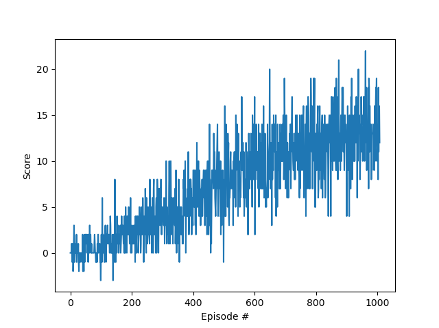

[//]: # (Image References)

[image1]: https://user-images.githubusercontent.com/10624937/42135619-d90f2f28-7d12-11e8-8823-82b970a54d7e.gif "Trained Agent"

# Banana Collector Project Report

### Project Details

### Learning Algorithm

Type algorihhm pseudocode here

Reward functions etc

Type of Network used

Parameters

    Include a GIF and/or link to a YouTube video of your trained agent!
    Solve the environment in fewer than 1800 episodes!
    Write a blog post explaining the project and your implementation!
    Implement a double DQN, a dueling DQN, and/or prioritized experience replay!
    For an extra challenge after passing this project, try to train an agent from raw pixels! Check out (Optional) Challenge: Learning from Pixels in the classroom for more details.

### Training Process Plots

#### We also trained the agent with Double Q method

The agent was able to solve the environment but it took a lot longer than with Dueling.

    Environment solved in 1008 episodes!	Average Score: 13.00
    --- Training took 1005.5937979221344 seconds ---

### Ideas for Future Work

There has been a lot of advancements lately in the field of DRL. Few interesting ideas to try include Prioritised Experience Replay and Rainbow. 
Try implementing Open AI best practices [openai/baselines](https://github.com/openai/baselines) to see if, or how much the algorithm can be improved.

[ADD LINKS HERE]

### Sources:

- [Sutton, Richard & Barto, Andrew. Reinforcement Learning: An introduction](http://incompleteideas.net/book/RLbook2018.pdf)
- [Human-level control through deep reinforcement learning (Deep Mind)](https://storage.googleapis.com/deepmind-media/dqn/DQNNaturePaper.pdf)
- [Dueling Double Q Implementation](https://github.com/simoninithomas/Deep_reinforcement_learning_Course/tree/master/Dueling%20Double%20DQN%20with%20PER%20and%20fixed-q%20targets)
- [Udacity Deep Reinforcement Learning Nanodegree](https://www.udacity.com/course/deep-reinforcement-learning-nanodegree--nd893)
- [Udacity Deep Reinforcement Learning Git](https://github.com/udacity/deep-reinforcement-learning)

