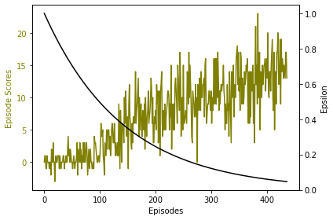
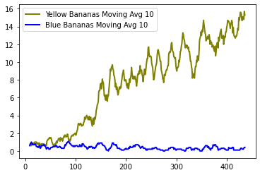

[//]: # (Image References)

[image1]: https://user-images.githubusercontent.com/10624937/42135619-d90f2f28-7d12-11e8-8823-82b970a54d7e.gif "Trained Agent"

# Banana Collector Project Report

### Project Details
We train an agent to navigate in a large square shaped space and collect yellow bananas while avoiding blue bananas. The agent interacts and receives feedback from ([Unity ML Agent](https://github.com/Unity-Technologies/ml-agents)) envionment using Python API. The problem is considered solved when the agent manages to collect 13 bananas on average over 100 consecutive episodes.

### Training Process 
Here we illustrate the training process before discussing training algorithm.
#####Agent before training

An untrained agent just spins around and doesn't have a clue what to do:

Training took 437 episodes, maybe it would go even faster if we epsilon decay speed: 

The agent did learn to collect yellow bananas really well. Interestingly, however, it keeps collecting blue bananas:

We also implemented double Deep Q solution which took more than 1000 episodes to converge. The above is significant improvement to that.

#####Agent after training

### Learning Algorithm

The agent was trained using Dueling Double Deep Q Learning (DDDQL) algorithm introduced in [Dueling Network Architectures for Deep Reinforcement Learning](https://arxiv.org/abs/1511.06581) paper.
The agent interprets the environment using a deep neural network. As suggested in the paper, the neural net has two streams - one for estimating State value V(s) and another one to estimate Advantage values A(s, a). 

State of the Banana environment is a vector size of 37, we put it through a fully connected neural network with 2 hidden layers and use ReLu activation functions between the layers:
- A(s, a): fully connected, input 37 - output 64 - output 64 -> 4 (action size)
- V(s): fully connected, input 37 - output 64 - output 64 -> 1 (state value)
- Output: V(s) + ( A(s, a) - mean[ A(s,a) ] )

Parameters

    Include a GIF and/or link to a YouTube video of your trained agent!
    Solve the environment in fewer than 1800 episodes!
    Write a blog post explaining the project and your implementation!
    Implement a double DQN, a dueling DQN, and/or prioritized experience replay!
    For an extra challenge after passing this project, try to train an agent from raw pixels! Check out (Optional) Challenge: Learning from Pixels in the classroom for more details.

### Ideas for Further Research
There has been a some interesting advancements lately in the field of DRL and some interesting ideas are for example [Prioritised Experience Replay](https://arxiv.org/abs/1511.05952) and [Rainbow](https://arxiv.org/abs/1710.02298), 
which combines recent improvements in DRL. Incorporating these would probably make the training process significantly faster.

### Sources:

- [Sutton, Richard & Barto, Andrew. Reinforcement Learning: An introduction](http://incompleteideas.net/book/RLbook2018.pdf)
- [Human-level control through deep reinforcement learning (Deep Mind)](https://storage.googleapis.com/deepmind-media/dqn/DQNNaturePaper.pdf)
- [Dueling Network Architectures for Deep Reinforcement Learning](https://arxiv.org/abs/1511.06581)
- [Dueling Double Q Implementation](https://github.com/simoninithomas/Deep_reinforcement_learning_Course/tree/master/Dueling%20Double%20DQN%20with%20PER%20and%20fixed-q%20targets)
- [Udacity Deep Reinforcement Learning Nanodegree](https://www.udacity.com/course/deep-reinforcement-learning-nanodegree--nd893)
- [Udacity Deep Reinforcement Learning Git](https://github.com/udacity/deep-reinforcement-learning)

